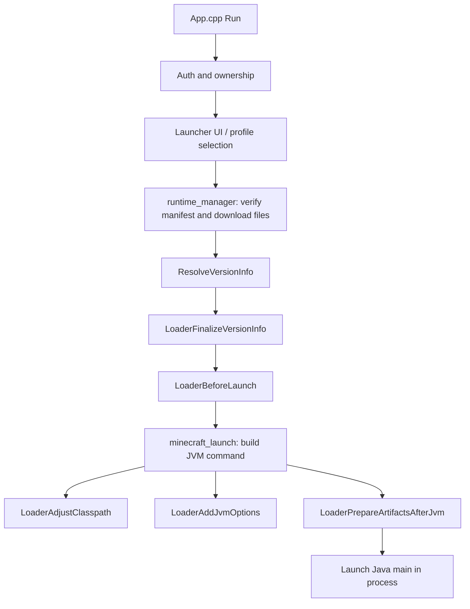

# Architecture

This page describes how the Bandit Launcher UWP host is organized after the `App.cpp` split. It is meant for contributors who need to find launch, auth, UI, or loader code quickly.

## Overview

Bandit Launcher is a single UWP process that:

1. Authenticates the user with Microsoft and verifies Minecraft Java ownership.
2. Manages profiles, mods, and launcher UI state.
3. Verifies and downloads official runtime files into `LocalState`.
4. Embeds the JVM, applies loader specific launch rules, and starts Minecraft.
5. Exposes optional local network file access and diagnostics collection.

The UWP shell in `MC.Xbox/App.cpp` orchestrates startup and menu flow. Most behavior lives in feature folders under `MC.Xbox/`.

## Source Layout

```text
MC.Xbox/
  App.cpp                 UWP entry, App lifecycle, Run() orchestration
  runtime_config.h.in     Build time version template
  common/                 Shared helpers, crash reports
  net/                    HTTP client, remote file server
  auth/                   Microsoft / Minecraft auth
  ui/                     Launcher UI, auth screen, UI globals
  mods/                   Modrinth browser, defaults, mod types
  profiles/               Profile storage and target selection
  launch/                 Runtime downloads, JVM launch, loader dispatch
    app_globals.*
    runtime_manager.*
    minecraft_launch.*
    launch_internal.*
    loaders/
      loader.*            Loader dispatch facade
      loader_common.*     Shared loader parsing/helpers
      fabric.*            Fabric launch provider
      neoforge.*          NeoForge launch provider
      forge.*             Forge launch provider (1.20.1 implemented)
```

`build.ps1` compiles sources from these folders with include paths for `.`, `common`, `net`, `auth`, `ui`, `mods`, `profiles`, `launch`, and `launch/loaders`.

## Module Responsibilities

| Module | Responsibility |
| --- | --- |
| `App.cpp` | `wWinMain`, CoreApplication lifecycle, high level `Run()` sequencing between auth, UI, downloads, and launch. |
| `common/launcher_common` | Path helpers, environment access, shared string/path utilities used across modules. |
| `common/crash_report` | Collect launcher and game diagnostics into crash report archives. |
| `auth/minecraft_auth` | Device code sign in, token exchange, ownership verification, session state. |
| `ui/launcher_ui` | Main menu rendering and interaction. |
| `ui/auth_screen` | Sign in screen and QR/device code presentation. |
| `mods/mods_browser` | Modrinth search, version resolution, install into active profile. |
| `mods/mod_defaults` | Launcher seeded mod compatibility defaults per target. |
| `profiles/profiles` | Profile CRUD, per profile game dirs, selected launch target. |
| `net/http_client` | Shared HTTP helpers for downloads and APIs. |
| `net/remote_file_server` | Local network upload/download UI backend. |
| `launch/runtime_manager` | Manifest verification, parallel downloads, version JSON resolution, native library prep. |
| `launch/minecraft_launch` | Shared JVM embed path: classpath assembly, natives, game args, process local Java startup. |
| `launch/launch_internal` | Low level Java invocation helpers used by loader specific prep. |
| `launch/loaders/*` | Loader specific version finalization, artifact prep, classpath, and JVM args. |

## Launch Flow



### Runtime preparation

`launch/runtime_manager.cpp` owns most download and version resolution work:

- Reads packaged `download_manifest.tsv` and per target manifests under `runtime/manifests/`.
- Verifies SHA1 hashes under `LocalState`.
- Downloads missing or stale official libraries, client metadata, and assets.
- Prepares native library folders for the selected target.

When version JSON needs loader specific fields, `ResolveVersionInfo()` delegates to `LoaderFinalizeVersionInfo()` in `launch/loaders/loader.cpp`.

### Shared JVM launch

`launch/minecraft_launch.cpp` handles the common embed path:

- Locates packaged JREs (`jre`, `jre21`, and `jre17` when packaged for Java 17 targets).
- Syncs bundled loader mods from `runtime/version-mods/<target-id>/` into the active profile `mods/` folder for Forge and NeoForge launches.
- Builds the base classpath from resolved version data.
- Applies UWP native library paths and GLFW shim placement.
- Calls loader hooks before adjusting classpath and JVM options.
- Starts the selected main class in the same UWP process.

Loader specific behavior should not be reimplemented here. Add or extend a loader module instead.

## Loader Plugin Pattern

`launch/loaders/loader.h` defines the loader dispatch surface:

| Hook | Purpose |
| --- | --- |
| `LoaderFinalizeVersionInfo` | Fill loader specific version metadata after base resolution. |
| `LoaderBeforeLaunch` | Pre launch filesystem or config preparation. |
| `LoaderAdjustClasspath` | Add loader jars, patched clients, or module path entries. |
| `LoaderAddJvmOptions` | Add loader specific JVM flags, patch module args, or system properties. |
| `LoaderPrepareArtifactsAfterJvm` | Late artifact generation that needs JVM helpers. |

`launch/loaders/loader.cpp` parses the active loader id and forwards each hook to the matching provider.

Shared parsing helpers live in `launch/loaders/loader_common.*`.

### Fabric

`launch/loaders/fabric.cpp` handles Fabric loader versioning, classpath additions, and Fabric specific JVM arguments for supported targets.

### NeoForge

`launch/loaders/neoforge.cpp` is the largest provider today. It covers:

- NeoForge install metadata and artifact preparation.
- FML/UCP config generation.
- Patched client handling from downloaded official inputs.
- securejarhandler patch module arguments.
- NeoForge classpath and JVM option assembly.

NeoForge generates patched client artifacts on first launch from downloaded official inputs. Do not commit or redistribute generated NeoForge client jars.

### Forge

`launch/loaders/forge.cpp` implements the experimental `1.20.1 + Forge 47.4.20` provider. It follows the same loader hook pattern as NeoForge:

- Reads Forge install metadata from the generated download manifest.
- Prepares SRG client artifacts from downloaded official inputs (similar to NeoForge patched client generation).
- Assembles Forge classpath and JVM options, including `legacyClassPath` alignment for FML.
- Runs late artifact preparation after the embedded JVM starts when needed.

Forge patched client jars are generated locally during build or first launch prep from official inputs. Do not commit or redistribute generated Forge client jars.

Other Forge catalog rows (for example `1.18.2`) may exist in `config/versions.tsv` before their providers are implemented.

To add another Forge target:

1. Extend the provider logic in `launch/loaders/forge.cpp`.
2. Add or update the target row in `config/versions.tsv`.
3. Ensure `build.ps1` generates the matching manifest and any per target controller mod jar.
4. Confirm dispatch in `launch/loaders/loader.cpp` covers the new loader version.

## Build Time vs Runtime Configuration

At build time, `build.ps1` generates `runtime_config.h` from `MC.Xbox/runtime_config.h.in` using values from `scripts/config.ps1` and CLI overrides. That header supplies default package versions to host modules.

At runtime, the launcher reads:

- `runtime/version_catalog.tsv` for selectable targets.
- `runtime/manifests/<target-id>.tsv` for per target download requirements.
- `download_manifest.tsv` for shared official runtime verification.

Changing the default target requires updating `scripts/config.ps1` and usually `config/versions.tsv`. See [BUILDING.md](BUILDING.md) for the full checklist.

## Related Projects In This Repo

| Path | Role in launch |
| --- | --- |
| `glfw_shim/` | Replaces desktop `glfw.dll` behavior for UWP windowing, input, and EGL. |
| `compat_mod/` | Fabric compatibility mod: filesystem, graphics, and controller fixes per target. |
| `forge_controller_mod/` | Forge Xbox controller mod built into `runtime/version-mods/<target-id>/`. |
| `patch/` | Supplies patched Fabric Loader classes and securejarhandler UWP changes packaged into the APPX. |
| `mesa-runtime/` | Series console OpenGL translation runtime packaged under `graphics/`. |

## Where To Start For Common Tasks

| Task | Start here |
| --- | --- |
| Add a Fabric target | `config/versions.tsv`, `scripts/config.ps1`, `launch/loaders/fabric.cpp`, [BUILDING.md](BUILDING.md) |
| Add a NeoForge target | `config/versions.tsv`, manifest generation in `scripts/`, `launch/loaders/neoforge.cpp` |
| Add another Forge target | `launch/loaders/forge.cpp`, `config/versions.tsv`, `forge_controller_mod/` if controller support is needed |
| Change bundled controller behavior | `compat_mod/` (Fabric), `forge_controller_mod/` (Forge), `glfw_shim/glfw_uwp.cpp`, `mods/mod_defaults.cpp` |
| Change sign in or ownership checks | `auth/minecraft_auth.cpp` |
| Change main menu or auth UI | `ui/launcher_ui.cpp`, `ui/auth_screen` |
| Change downloads or repair behavior | `launch/runtime_manager.cpp` |
| Change Modrinth install behavior | `mods/mods_browser.cpp` |
| Change remote uploads | `net/remote_file_server.cpp` |

## Auth Boundary

Bandit Launcher requires legitimate Microsoft/Xbox authentication and Minecraft entitlement verification. Architecture changes must keep that boundary intact. Do not add offline fallbacks, optional auth switches, or alternate launch paths that skip ownership checks.

See [CONTRIBUTING.md](../CONTRIBUTING.md) and [LEGAL.md](LEGAL.md).
